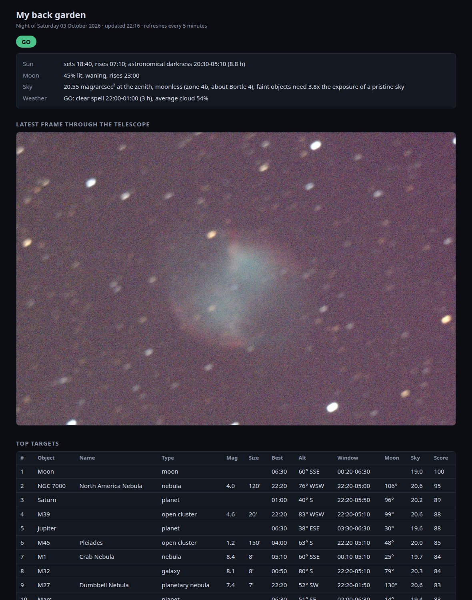
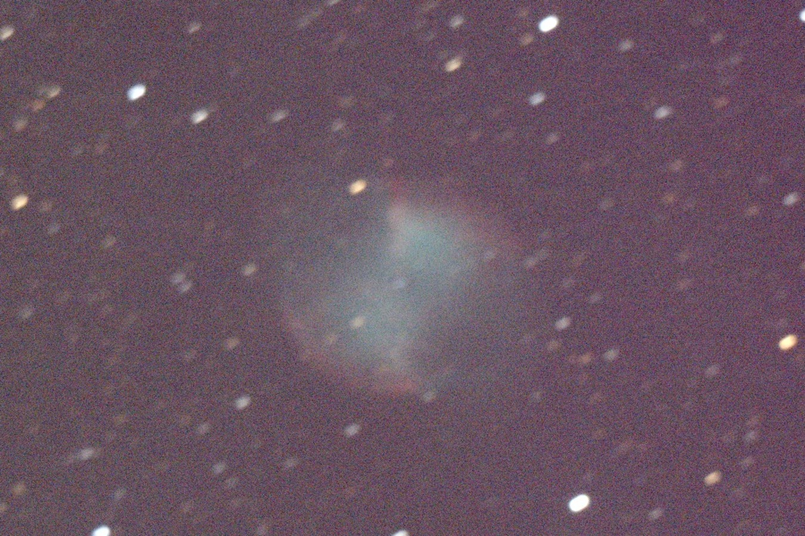

# telescopeyoke 🔭

**Turn an ordinary SynScan telescope into a locally controlled smart telescope.**

*Give your old SynScan telescope a brain.*

[](https://github.com/Ryan-Clinton/telescopeyoke/actions/workflows/tests.yml)



telescopeyoke is a lightweight telescope automation system for Linux. It
also runs natively on Windows, where the tests and the demo pass but no
camera or mount has been used yet. It runs
on a laptop left beside a modest SynScan telescope and camera, and you watch
from indoors. It plans the night, checks the weather and moonlight, ranks
targets for your own sky, slews the mount, plate-solves where the telescope is
really pointing, re-centres the target, helps you focus, and stacks short
exposures into a picture.

It is built for the inexpensive gear many amateur astronomers already own,
and for the things that gear gets wrong: a handset with the wrong time, a home
position set by eye, a rough polar alignment.

## What it does

- 🌙 **Plans tonight's observing**: darkness, Moon, and a GO / MARGINAL / NO-GO verdict
- ☁️ **Checks cloud, rain, wind, dew and seeing**, plus a live satellite cloud picture
- 🎯 **Ranks targets for your actual sky**: altitude, moonlight, light pollution, blocked horizons
- 🔭 **Controls SynScan mounts** through the handset, with the handset's clock errors corrected
- 🧭 **Plate-solves and centres GoTos automatically** (`goto M27 --solve`)
- 🔊 **Talks you through focusing**, eyes on the focuser not the screen: "Improving. 4.8" … "Minimum passed. Reverse slightly" … "Best focus. Hold"
- 📐 **Makes the best of a rough polar alignment**: measures how far out the mount is, predicts the drift that causes anywhere in the sky, and creeps a motor against it
- 📷 **Captures and stacks images**: every raw frame kept, poor frames rejected, stars lined up to a fraction of a pixel, satellite trails clipped out
- 🏠 **Shows it all on a status page** you can watch from indoors: the verdict, the run's progress and star quality frame by frame, the live stack, what to point at now, and the state of the kit
- 🛑 **Keeps the mount inside physical limits**, with a motion lock and a webcam watching every slew

## See it working

**Planned.** The page at the top is what `./serve.py` shows: tonight's
verdict and the targets worth pointing at, ranked for your sky.

**Found.** A real run from the first night. The mount's home position had
been set by eye and was about ten degrees out; the telescope photographed the
sky, worked out where it really was, and corrected itself:

```
$ ./mount.py goto M27 --solve
M27 Dumbbell Nebula: altitude 57°, hour angle +0.36 h (west: the tube will swing over the pole)
  off by -107.0' in hour angle, +94.4' in Dec
  off by -6.2' in hour angle, -11.4' in Dec
  off by +1.0' in hour angle, -1.8' in Dec
  centred
```

**Captured.** The Dumbbell Nebula (M27) from that night: 48 two-second
exposures through a 150 mm Newtonian on an EQ3 mount that was polar aligned
by eye.



## Quick start

**Try it with no telescope and no setup:**

```bash
git clone https://github.com/Ryan-Clinton/telescopeyoke
cd telescopeyoke
./install.sh --planner        # Python libraries only (Ubuntu/Debian)
./doctor.py                   # what is installed and connected
./tonight.py --demo           # tonight's report with made-up weather
./serve.py --demo             # the web page, on http://localhost:8080
./mount.py --demo goto M27    # drive a simulated mount
```

On Windows 10 or 11, in PowerShell: `.\install.ps1`, then the same commands
written as `python doctor.py`, `python tonight.py --demo` and so on, and
`.\ty.cmd` (or `python ty`) for `./ty`. See [Setup](docs/setup.md#windows).

**Prefer buttons?** `./console.py --demo` opens the control console in your
browser: Targets, Mount, Focus, Imaging, Tools and System screens, on this
computer only. With a real mount, every move is checked with a dry run and
shown as a plan, and nothing moves until you confirm it. It has not yet been
used with a real mount or camera.

**Use the planner for real** (still no telescope needed): put your location
in `config.toml`, then `./tonight.py`.

**Run a telescope:** `./install.sh`, then follow [Setup](docs/setup.md).

## Three parts, usable separately

| Part | Commands | Needs |
|---|---|---|
| **Planner** | `tonight.py`, `serve.py`, `clouds.py` | Any computer with Python. No telescope. |
| **Control** | `mount.py`, `polaralign.py`, `watch.py` | A SynScan mount and its serial lead. |
| **Imaging** | `snap.py`, `focus.py`, `solve.py`, `shoot.py`, `skywatch.py` | A supported camera and ASTAP. On Linux the camera is read through INDI; on Windows through Altair's own library, which is the only camera route there. |

Start with the planner; add hardware when you have it.

## Hardware

| Hardware | Status |
|---|---|
| Sky-Watcher EQ3 Pro SynScan, handset firmware 3.35, FTDI serial lead | ✅ Tested by the author |
| Sky-Watcher Explorer 150P (150 mm f/5 Newtonian) | ✅ Tested by the author |
| Altair Hypercam 183C on USB 2 | ✅ Tested by the author |
| Ubuntu 26.04, Python 3.14 | ✅ Tested by the author |
| Python 3.11, 3.12, 3.13 | ✅ Tests pass in CI (no hardware) |
| Windows 10 and 11 | ⚠️ Tests and the demo pass with no hardware (Windows 11, Python 3.12). No camera or mount has been used on Windows yet. |
| EQ5, HEQ5, EQ6 with a SynScan handset | ⚠️ Untested. Likely: same serial protocol. |
| Other INDI cameras | ⚠️ Untested. Likely for mono or RGGB colour sensors: set the driver and sensor size in `config.toml`. |
| Other telescopes | Set the focal length in `config.toml`. |
| Mounts driven without a handset (EQDIR), ASCOM, Alpaca | ❌ Not supported. |

Tested on one setup so far, and nobody but the author has run it yet. If you
try it on anything, working or not, please open a **Hardware compatibility
report** issue; rows marked "community tested" will be added from those.

## Commands

| Script | What it does |
|---|---|
| `tonight.py` | Report for the night: darkness, Moon, weather verdict, ranked targets. `--html` writes the web page. |
| `serve.py` | Serves the status page on port 8080: the night's report rebuilt every 10 minutes, and the imaging run, pictures and system panel refreshed every two seconds. |
| `clouds.py` | Fetches the latest infrared satellite image with the site marked on it. |
| `mount.py` | Moves the mount: `status`, `home`, `zenith`, `goto NAME [--solve]`, `point AZ ALT`, `sync`, `drift`, `compensate`, `stop`. |
| `liveview.py` | Takes a frame every few seconds so the status page shows what the telescope sees now. Steps aside while `shoot.py` runs. |
| `console.py` | A control console in the browser, for the person beside the telescope: targets, GoTo with a plan to confirm, focusing, imaging, tools. This computer only. `./console.py --demo` tries it with nothing plugged in. |
| `horizon.py` | Sweeps the sky and reports which directions are blocked by houses, hedges and trees, as lines for `config.toml`. `--trace` follows the top of whatever is in the way right round and checks its own answer; `--daylight` works by day, going by brightness instead of stars. |
| `snap.py` | Takes one camera frame, saves the FITS in `frames/`, publishes a preview. |
| `shoot.py` | Takes a picture: many short exposures, each checked, lined up and stacked live, with the raw frames kept. `--exposure auto` picks the longest exposure the tracking allows. `--frames 0` carries on until cloud stops it. While it runs, `./ty run stop` ends it cleanly with its final picture; `recentre`, `assist-on` and `assist-off` are also understood. |
| `restack.py` | The quality pass: goes back over a session's raw frames, keeps the best, weights and clips them, and writes the finished picture. `shoot.py` runs it at the end. `--all`, or several session folders, stacks sessions from one night or many into one picture. |
| `calibrate.py` | Makes master dark, bias and flat frames, which `shoot.py` and `restack.py` then apply automatically. |
| `camera_setup.py` | Gets the camera ready: checks it is plugged in and has a driver, takes Altair's library files out of their SDK zip if they are missing, and takes a test frame. `--check` only looks. Also the "Set up the camera" button in the console. |
| `camera_test.py` | `--capabilities` lists what the camera offers; `--throughput` times every way of getting frames off it; `--gain-sweep` tries a range of gains on tonight's sky and suggests one. |
| `compare.py` | Shows the same patch of sky from several stacks side by side at full size, with star measurements for each. |
| `process.py` | Turns a finished stack into a cleaner picture: level sky, white stars, smoothed colour noise. |
| `focus.py` | Hands-free focusing aid: measures many stars at once and speaks the result. `--tones` for a rising pitch instead of speech, `--scene` for a daytime view. |
| `solve.py` | Plate-solves a frame: where is the telescope really pointing? |
| `polaralign.py` | Measures how far the polar axis is from the pole, from three plate solves. |
| `skywatch.py` | Photographs the sky every minute and stops when stars appear. |
| `doctor.py` | Checks what is installed and connected, and says what is ready: planner, mount, imaging. |
| `replay.py` | Turns a centring run recorded with `mount.py goto --solve --record` into a GIF. |
| `watch.py` | Photographs the telescope itself with the webcam. |
| `build_catalogue.py` | Regenerates `data/targets.csv` from OpenNGC. |
| `ty` | One front door for programs and AI agents: `capabilities`, `status`, `context`, `night`, `targets`, `target NAME`, `session`, `observing`, `doctor`. Add `--json` for a fixed machine-readable shape. |
| `mcp_server.py` | Read-only MCP server offering the same information to MCP-aware assistants. |

`tonight.py`, `serve.py` and `mount.py` accept `--demo`.

The status page shows two pictures while imaging: **Now**, the newest single
exposure straight from the camera, and **Live stack**, everything added up so
far.

## How it works

It is deliberately small: a dozen short scripts with plain names
(`mount.py`, `focus.py`, `solve.py`, `shoot.py`, `tonight.py`). One person
can read it and understand how the whole telescope works, and it means to
stay that way.

```
plan the night → GoTo → photograph → plate-solve (ASTAP) → correct → photograph … → stack
```

- **`sky.py`** does the astronomy locally with astropy: positions, darkness,
  moonlight (Krisciunas & Schaefer's model), and a score for each target.
- **`feeds.py`** fetches weather, seeing, light pollution and comets, and
  caches them so the report still works when the Wi-Fi drops.
- **`mount.py`** speaks the SynScan handset's serial protocol. It measures how
  wrong the handset's clock is and corrects every GoTo for it, steers by the
  raw axis angles where the handset's own GoTo is unreliable, and stores the
  pointing error found by plate solving.
- **`indi.py`** is a small INDI client written for this project: about 150
  lines that read and set properties and receive image BLOBs over the XML
  protocol, with no dependencies. The stock INDI command-line tools cannot
  address a device whose name contains a dot, which this camera's does.
- **`camera.py`** wraps that into "give me a frame", and recovers when the
  driver stalls.
- **`stacking.py`** is the imaging pipeline's working parts, used live by
  `shoot.py` and again afterwards by `restack.py`.
- **`tracking.py`** predicts the drift a misaligned polar axis causes and
  decides how to trim the Dec motor against it.
- **`page.py`** lays the report out as the status page. It is plain HTML
  with a little JavaScript reading `status.json`: no framework, no controls.
- **`simulator.py`** is a pretend handset and mount behind `--demo` and the
  tests.

## Going deeper

| Page | What is in it |
|---|---|
| [How a picture is made](docs/imaging.md) | Calibration, frame checks, lining up, stacking, the quality pass. |
| [Focusing by ear](docs/focus.md) | Turn the knob and the laptop talks you onto focus. |
| [The mount is wonky; measure how wonky](docs/tracking.md) | Drift from a rough polar alignment, and how it is cancelled. |
| [Setup](docs/setup.md) | Installing, the camera driver, the plate solver, what the computer needs. |
| [For programs and AI agents](docs/agents/README.md) | `--json`, `--dry-run`, the `ty` command, the web API and the MCP server. |
| [Checking it under real sky](docs/validation.md) | The five experiments that will show whether the clever parts work. |

**Focus without looking at the laptop.** `./focus.py` measures up to 40 stars
at once and speaks: "Improving", "Best focus. Hold", "Minimum passed. Reverse
slightly". It ignores the shimmer of the air, so it does not send you chasing it.

**For programs and AI agents**, every command answers in one JSON shape with
`--json`, anything that moves the mount can be checked first with `--dry-run`,
and a read-only web API and MCP server offer the same information. Start with
[AGENTS.md](AGENTS.md).

## A night's routine

1. Set the mount in the home position, power on, and take the handset to its
   main menu.
2. `./mount.py zenith` to measure the handset's clock and check the mount
   moves correctly.
3. Focus: `./focus.py --scene` on something distant in daylight, then
   `./focus.py` on stars. Turn the focuser slowly and listen: stop at "Best focus. Hold".
4. `./mount.py sync` on any patch of stars, so later GoTos allow for the home
   position having been set by eye.
5. `./mount.py goto M27 --solve`, then `./shoot.py M27 --frames 48 --recentre 8`.

Commands that move the mount need serial access; until you have logged out
and back in after joining the `dialout` group, prefix them with
`sudo -u $USER -g dialout`.

## Safety

The laptop cannot see what the telescope is about to hit.

- **Start the handset properly.** After every power-on, press ENTER through
  the handset's start-up screens to its main menu, entering today's date. A
  handset still on its version screen accepts commands but moves the mount by
  the wrong amounts. `mount.py` refuses to run if the handset's date is still
  its default.
- **Power on in the home position**: counterweight bar at the lowest point of
  its swing, tube on top, pointing at the pole.
- **Keep the tripod legs clear** and leave slack in the cables. Targets west
  of the meridian swing the tube over the pole.
- **Never point near the Sun.** `mount.py point` refuses within 40° of it
  while it is up; `goto` only knows night-sky objects.
- Creating a file called `MOTION_LOCKED` in this folder blocks all movement.
- `mount.py` will not go below 20° altitude or more than 5.75 hours from the
  meridian.
- **The status page (`serve.py`) is read-only on purpose.** It is served to
  the whole home network with no login, which is fine for pictures and
  reports. Nothing that moves the mount will be added to it.
- **The control console (`console.py`) answers this computer only.** It
  needs a key made each time it starts, shows every move as a plan first,
  and moves the mount only when that plan is confirmed.

## Current status

Working on real hardware and real stars: the night report and web page,
mount moves through the handset, camera frames, focusing, plate solving,
`goto --solve` (centres a target to a fraction of an arcminute) and `sync`.
The pictures on this page came from an earlier, simpler version of
`shoot.py`.

Rewritten since those pictures, tested on simulated star fields, and being
proven on real sky: the stacking pipeline (frame scoring and rejection,
sub-pixel and rotation alignment, clipped and weighted stacking, saved raw
frames, the quality pass).

Windows: the tests and every `--demo` command pass, on Windows 11 with
Python 3.12, with nothing plugged in. That is the first of three levels and
the only one reached. The camera has not taken a frame on Windows, and the
mount and camera have not been used together there. The Windows camera route
(`altair.py`, which reads the camera through Altair's own library instead of
INDI) has only been run against a made-up copy of that library, on either
system. The handset's FTDI lead has been found by name among the COM ports,
but nothing has been sent to the handset from Windows. The plate solver's
Windows paths, the DirectShow webcam and the spoken focusing aid are untried
on real equipment.

Written but not yet run for real: `calibrate.py` (no dark or flat frames have
been taken yet) and `camera_test.py --gain-sweep`.

Rewritten since they were last used on real hardware, and so far proven only
against the simulator and made-up data: `focus.py` (multi-star HFR and the
new spoken guidance), `mount.py drift` (line-fitted, with the drift model),
`mount.py compensate` and `shoot.py --assist`. An earlier, cruder
`mount.py drift` did cancel most of the drift on the real mount.

Written but never run on the real mount: `polaralign.py` (its geometry is
checked by the tests against a simulated misaligned mount).

Written but never used with a real mount or camera: the control console
(`console.py`). Its server, its refusals, the plan-then-confirm step and Stop
are tested against the simulated mount and stand-in jobs; the page has been
looked at in demo mode only. How long Stop takes during a real slew, on
Linux and on Windows, has not been measured.

Written but never run on the real mount or camera: `horizon.py --trace` and
`horizon.py --daylight`. The following and its checks are tested against the
simulated mount; the brightness levels that tell daytime sky from a wall are
first guesses and have not seen a real frame.

Covered by automated tests (`pytest`, run on every push on Python 3.11 to 3.14): the astronomy, the
mount logic against the simulated handset, frame alignment and hot-pixel
removal, star measurement and frame rejection, sub-pixel and rotation
registration, clipped stacking, calibration arithmetic, a whole simulated
imaging run, the focus measurement, the polar alignment geometry, the INDI
message handling, the drift formula against a mount modelled from first
principles, drift cancelling on both sides of the simulated mount, and the
demo report end to end. The tests cannot cover the
real mount, camera or sky.

Known limits:

- Camera frames are slow with this driver on USB 2: about 4 s plus five times
  the exposure, so light is collected only about a seventh of the time.
- After a slew the stars streak for up to half a minute while the gears
  settle; the scripts wait before photographing.
- With a rough polar alignment the aim drifts by an arcsecond or more per
  second, which limits exposures to a couple of seconds.
- The handset's GoTo overshoots right next to the pole, so `home` steers by
  the axis readout instead.
- The target ranking in `tonight.py` uses weights chosen by judgement.

## Roadmap

Near term:

- Someone other than the author running it. Reports from other SynScan
  mounts come before any new feature.
- Recordings for this page: a GoTo-and-centre run (`--record` and `replay.py`
  are ready for it) and a focusing session.
- More of the camera's quirks moved into `config.toml` as other cameras are tried.
- Faster frames: a newer camera driver, or USB 3. The camera currently
  collects light for about a seventh of the time, so this is the largest
  single gain available.
- Dark and flat frames taken and in use, and the gain chosen from a sweep
  instead of by guesswork.

Later, for image quality, in this order: colour calibration from catalogue
stars (the plate solve already identifies them); gentle deconvolution, once
calibration and alignment are proven; sky-gradient removal frame by frame;
drizzle on the raw Bayer frames. None of these before a controlled
comparison has shown what the current pipeline gains on real data.

Later, if people ask for them:

- Raspberry Pi or other small computer strapped to the telescope.
- Controls on the web page, behind a login.
- Letting an agent request a move over MCP, carried out only after a person
  approves that exact move (designed in `docs/agents/safety.md`, not built).
- The agent scenarios in `evals/` run with a real model in the loop.
- The MCP server moved onto the official MCP Python SDK, once MCP is a feature people
  rely on. Today's hand-written one speaks the protocol directly to avoid a dependency;
  the telescope logic stays in `agent.py` either way.
- Guiding and focuser support.

Not planned: ASCOM, mobile apps, a React front end, cloud services, AI target
selection, Docker images, plugin systems, a sequencing language. Bigger
projects (NINA, KStars/Ekos) do those well; this one stays small, readable,
and aimed at ordinary SynScan gear.

## Contributing

Reports from other hardware are the most useful contribution: open a
**Hardware compatibility report** issue with your mount, handset firmware and
camera, and what happened. For code, see [CONTRIBUTING.md](CONTRIBUTING.md):
run `pytest`, and anything that changes how the mount moves comes with a test
against `simulator.py`.

## Data sources

Weather: [Open-Meteo](https://open-meteo.com). Seeing: [7Timer](https://www.7timer.info).
Light pollution: [D. Lorenz's atlas](https://djlorenz.github.io/astronomy/lp/).
Comets: [COBS](https://cobs.si) and [JPL Horizons](https://ssd.jpl.nasa.gov/horizons/).
Cloud imagery: [EUMETSAT](https://view.eumetsat.int).

## Licence

MIT; see `LICENSE`. `data/targets.csv` is derived from
[OpenNGC](https://github.com/mattiaverga/OpenNGC) and is licensed
CC-BY-SA-4.0.
